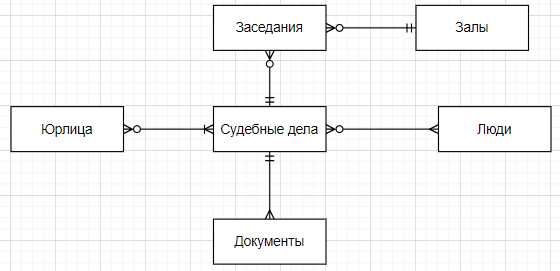

**Предметная область**

Суд

Состав команды: Агафонов, Забурдаев, Стрежнев, Цирульников

**Концептуальная модель**

Факт - Заседания. Остальное - измерения.

**Логическая модель**

Сразу стоит отметить, что база данных находится в 1НФ, потому что все атрибуты атомарны.  Далее стоит сказать, что база данных лежит в 2НФ, потому что отсутствуют аномалии вставки, удаления и обновления.

3НФ есть, потому что в любой сущности БД отсутствуют транзитивные зависимости неключевых атрибутов от потенциальных ключей. 

Таблицу Cases сделаем версионной, чтобы отслеживать статус дела.

**Физическая модель**

|**Meetings**|||||
| :- | :- | :- | :- | :- |
|**PK/FK**|**Название**|**Описание**|**Тип данных**|**Ограничение**|
|PK|meeting\_no|Идентификатор заседания|INTEGER|NOT NULL, UNIQUE|
|FK|room\_no|Номер зала|INTEGER|NOT NULL|
|FK|case\_id|Идентификатор дела|INTEGER|NOT NULL|
||meeting\_date|Дата заседания|DATE|NOT NULL|
||meeting\_time|Время заседания|TIME|NOT NULL|
||judge\_id|ИНН судьи |TEXT|NOT NULL|
||court\_decision|Итог заседания|TEXT|NOT NULL|

|**People**|||||
| :- | :- | :- | :- | :- |
|**PK/FK**|**Название**|**Описание**|**Тип данных**|**Ограничение**|
|PK|taxpayer\_id|ИНН |TEXT|NOT NULL, UNIQUE|
||first\_name|Имя|TEXT|NOT NULL|
||last\_name|Фамилия|TEXT|NOT NULL|
||passport\_series|Серия паспорта|NUMERIC(4, 0)|NOT NULL|
||passport\_number|Номер паспорта|NUMERIC(6, 0)|NOT NULL|
||birth\_date|Дата рождения |DATE||
||phone\_number|Телефон|VARCHAR(20)|REGEXP на телефонный номер|
||home\_address|Домашний адрес|TEXT||

|**Cases (версионная)**|||||
| :- | :- | :- | :- | :- |
|**PK/FK**|**Название**|**Описание**|**Тип данных**|**Ограничение**|
|PK|case\_id|Идентификатор дела|INTEGER|NOT NULL, UNIQUE|
||article|Статья, по которой ведется дело|TEXT|NOT NULL|
|PK|from\_date|Дата, с которой статус дела актуален|DATE|NOT NULL, UNIQUE|
||to\_date|Окончание срока актуальности статуса|DATE||
||status|Статус дела|TEXT||

|**Roles**|||||
| :- | :- | :- | :- | :- |
|**PK/FK**|**Название**|**Описание**|**Тип данных**|**Ограничение**|
|PK/FK|taxpayer\_id|ИНН|TEXT|NOT NULL|
|PK/FK|case\_id|Номер дела|INTEGER|NOT NULL|
||role|Роль стороны в деле|TEXT|NOT NULL, CHECK (role in (‘Судья’, ‘Адвокат истца’, ‘Прокурор’, ‘Адвокат подсудимого’, ‘Присяжный’, ‘Подсудимый’, ‘Истец’))|

|**Companies**|||||
| :- | :- | :- | :- | :- |
|**PK/FK**|**Название**|**Описание**|**Тип данных**|**Ограничение**|
|PK|taxpayer\_id|ИНН|INTEGER|
NOT NULL,

UNIQUE
|
||name\_of\_comp|Название компании|TEXT|NOT NULL|
||email|Эл. почта компании|TEXT|NOT NULL|
||legal\_address|Юридический адрес|TEXT|NOT NULL|

|**Courtrooms**|||||
| :- | :- | :- | :- | :- |
|**PK/FK**|**Название**|**Описание**|**Тип данных**|**Ограничение**|
|PK|room\_no|Номер зала (не зависит от этажа)|INTEGER|NOT NULL|
||floor|Этаж|INTEGER|NOT NULL, CHECK (floor BETWEEN 1 AND 6)|
||capacity|Вместимость зала|INTEGER|NOT NULL, CHECK (capacity > 0)|

|**Docs**|||||
| :- | :- | :- | :- | :- |
|**PK/FK**|**Название**|**Описание**|**Тип данных**|**Ограничение**|
|PK|doc\_id|Идентификатор документа|INTEGER|NOT NULL, UNIQUE|
|FK|case\_id|Номер дела|TEXT|NOT NULL|
||date|Дата подписания документа (при наличии)|DATE||
||type|Тип документа (справка, ходатайство, и т.д.)|TEXT|NOT NULL|

